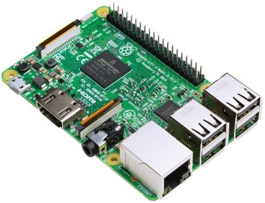

name: inverse
layout: true
class: center, middle, inverse
---
# わたしのもくもくネタ
@yamanetoshi

2018.3.17

http://bit.ly/2BF85oq
---
layout:false
## 書籍関連
### プログラマの数学 [http://amzn.to/2EQYJI1](http://amzn.to/2EQYJI1)
### 低レベルプログラミング [http://amzn.to/2Hucjj5](http://amzn.to/2Hucjj5)
### Anndroid 設計パターン入門 [http://bit.ly/2sG5Vlw](http://bit.ly/2sG5Vlw)
### Linuxのしくみ ~実験と図解で学ぶOSとハードウェアの基礎知識 [http://amzn.to/2ocO5Sn](http://amzn.to/2ocO5Sn)
---
## Android
### MVP パターンとか MVVM パターンとか
### ぐぐるがサンプル公開してるので読みたい [http://bit.ly/2cCNp3p](http://bit.ly/2cCNp3p)
### DroidKaigi2018UnitTestHandsOn [http://bit.ly/2EDrBjQ](http://bit.ly/2EDrBjQ)
### Kotlin...
---
## Python
### Python boot camp [http://bit.ly/2BGZOAj](http://bit.ly/2BGZOAj)

---
## FPGA
### Pynq 入手も何もしていない
### [http://bit.ly/2ECwCgx](http://bit.ly/2ECwCgx)

---
## 機械学習
### movidius 入手も何もしていない [http://bit.ly/2FhoAqA](http://bit.ly/2FhoAqA)
### ぐーぐるが面白い検証環境提供してます [http://bit.ly/2GssRqj](http://bit.ly/2GssRqj)

---
## Go ならわかるシステムプログラミング
### 確認したいが時間がない
### [http://bit.ly/2EDW8BP](http://bit.ly/2EDW8BP)

---
## 将棋
## 囲碁
### AI Player 作りたい

---
## 英語
### こつこつ [English Grammer in Use](http://amzn.to/2sABlti) 読んでいます
### [http://amzn.to/2sABlti](http://amzn.to/2sABlti)

---
## Android Things
### Raspberry Pi 入手も (ry
### [http://bit.ly/2olGmR9](http://bit.ly/2olGmR9)

---
## すごい広島
### もくもく会のひとつのフォーマット
### [http://great-h.github.io/](http://great-h.github.io/)
### この方式は良いです
### Github 使うのでリモート参加もアリ
---
## 最近那覇でもくもくし始めています
### ご参加ご希望の方はお声かけ下さいませ
### twitter は @yamanetoshi
### gmail は yamanetoshi@gmail.com
---
## そういえば
### 先日フロント系のもくもく会に出席
### もくもくするテーマは何でも OK ですよ
---
## Any question?
